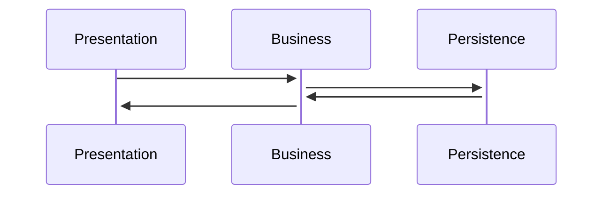
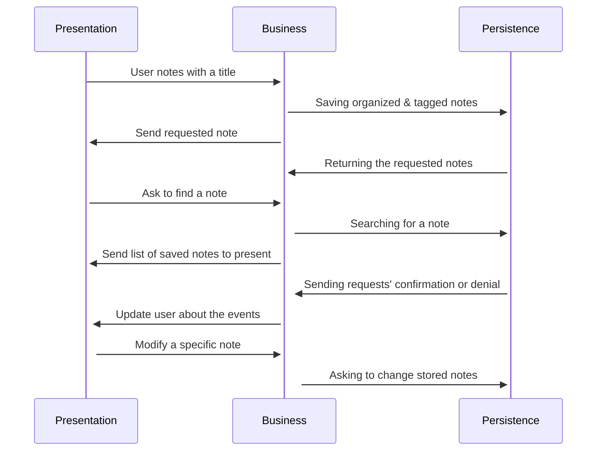

# Architecture

## Overview of the Architecture
We use a 3-tier architecture, where the code is separated by each layer and the layers have one 
responsibility each. The layers are:
* Persistence
* Business
* Presentation

The communication between the layers are represented as:

The presentation layer never performs the operations assigned to the persistence layer and vice versa. 
The same applies to the logic layer as well. The persistence layer deals with the storage and retrieval
of data. The business layer coordinates the application and processes the movement of data between the 
layers, and the presentation layer is what the user sees and how they interact with the interface.

### Persistence
This layer inserts, deletes, updates and lists the notes in the non-relational and relational database. The NotesDatabase and PagesDatabase interfaces use the comp3350.studywithme.tests.persistence package, and it has two classes that implement it - the NotesDatabaseStubs class, which is the non-relational database, and the NotesDatabaseHSQLDB class, which is the relational database. The two classes use the comp3350.studywithme.persistence.hsqldb package and the NotesDatabaseStubs class is currently in the persistence test folder. A DatabaseException class, that extends Java's built-in Exception class, has also been created to enable the throwing of exceptions in the NotesDatabaseHSQLDB class. The java built-in list and arraylist are used to implement the database and the notes arraylist gets its data from the Note and Page objects. The Page object is being handled under the Note object as the Page is created under the Note in the business layer.

### Business
This layer is responsible for manipulating data and combine or extract information to send over to
presentation or persistence layer. This layer also creates the actual objects and controls the flow
of data throughout the program. Many data verification happens in this layer to prevent generation of 
invalid input and output by both user and database. NoteManageable and PageManageble interfaces are implemented 
by NoteManage class in package comp3350.studywithme.business.manage. Classes under the package comp3350.studywithme.business 
implement mechanisms necessary for creation of notes, editing, and, saving. In later iterations
and closer to the final realise, this layer would also perform more project specific tasks, such as 
note studying recommendation to the user.

### Presentation
This layer creates all Android related user interface. This layer is responsible to control and manage 
activities and windows visible to the user. It includes fields for typing, buttons to act something etc.
Presentation layer also controls the flow of input with out manipulation and sends them to the business
layer through project specific standardized interfaces. 

### Diagram
This diagram shows an abstract ways of communication between described layers. This diagram simplifies 
methods and types of data transferred.

Winter 2023
