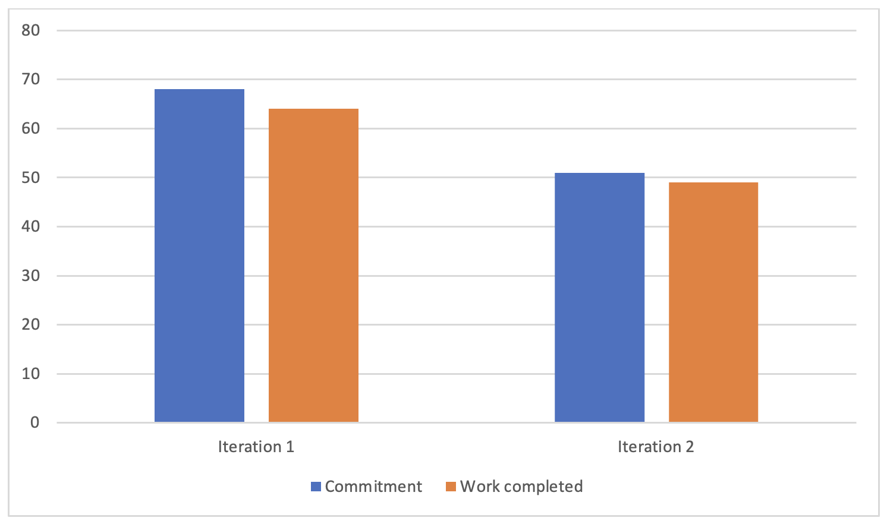

# Retrospective

In the past, during the initial stages of our project, we faced several challenges that hindered our progress and prevented us from accomplishing our goals. Prior to iterations one and two, we overcommitted ourselves, setting unrealistic expectations that we couldn't achieve within the given time frame. This left us struggling to complete tasks and deliverables, and as a result, certain components of the program that we had planned from the outset, such as flashcards, quizzes, and other interactive elements, remained unfinished.
Additionally, we encountered issues with our project management, particularly in updating developer tasks. This delayed updating made it difficult for us to accurately estimate the project's velocity and allocate resources effectively. Consequently, we were forced to scramble to complete all pending work right before the due date, which led to a last-minute rush that negatively impacted the overall quality of our submission.
Furthermore, our team faced difficulties in resolving conflicts that arose during the development process. These disagreements not only hampered our progress but also created unnecessary stress and tension within the team. In hindsight, we recognize the importance of addressing such issues promptly and constructively, to ensure a smoother and more productive workflow moving forward.

Following the challenges faced during the first iteration, we took a step back to reassess our approach and develop more realistic and manageable plans for the subsequent iterations. For iteration 2, we carefully reviewed our feature list and determined which elements could be feasibly completed within the allotted time. We then adjusted our commitments for iteration 3 accordingly, aiming to ensure that all tasks could be finished in a timely manner. The success of these adjustments will be evaluated upon the completion of all work at the end of iteration 3.
To further optimize our workflow, we removed some unfinished features from our project scope. This allowed us to allocate more time and resources to the remaining features and concentrate our efforts more effectively. The success of this decision will be measured by our ability to complete all planned features by the end of iteration 3.
In terms of project management, we improved our approach to developer tasks by planning them early and updating their status in real time on GitLab. This allowed us to track progress more efficiently, with each team member responsible for closing their assigned issues upon completion. The success of this strategy will be evaluated based on individual task ownership and prompt issue closure before the end of iteration 3.
To avoid the last-minute rush experienced in previous iterations, we opted to divide our tasks on a weekly basis, setting smaller, more manageable deadlines for each team member. This approach will be considered successful if we can consistently close all assigned tasks for each week, thus ensuring a more balanced workload.
Finally, we addressed the issue of conflicts within our team by ensuring that no two members worked on the same class simultaneously. Additionally, we established a communication protocol whereby any changes were discussed with the entire group beforehand, minimizing the potential for conflicts. The success of this conflict resolution strategy will be assessed by comparing the number of conflicts in iteration 3 to those in iteration 2, with the aim of significantly reducing conflict occurrences.

